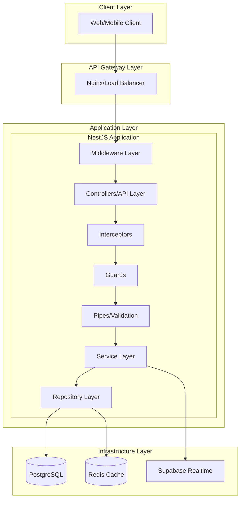
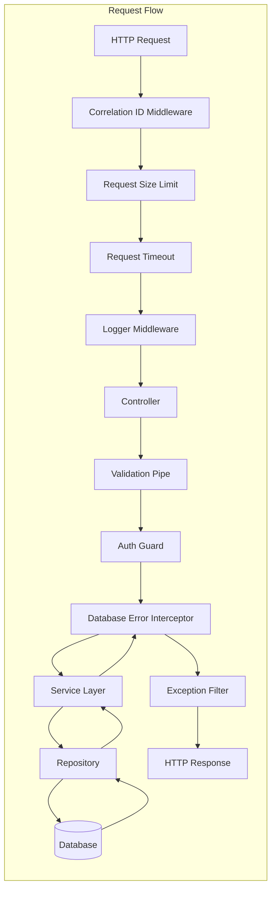
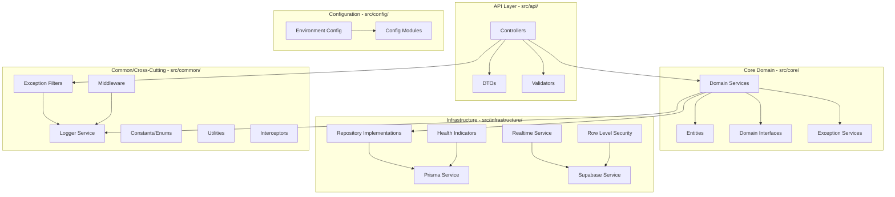
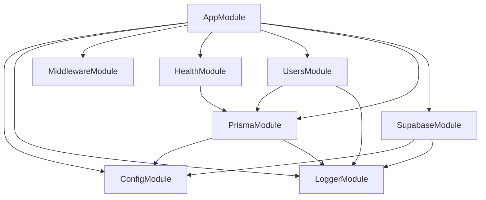
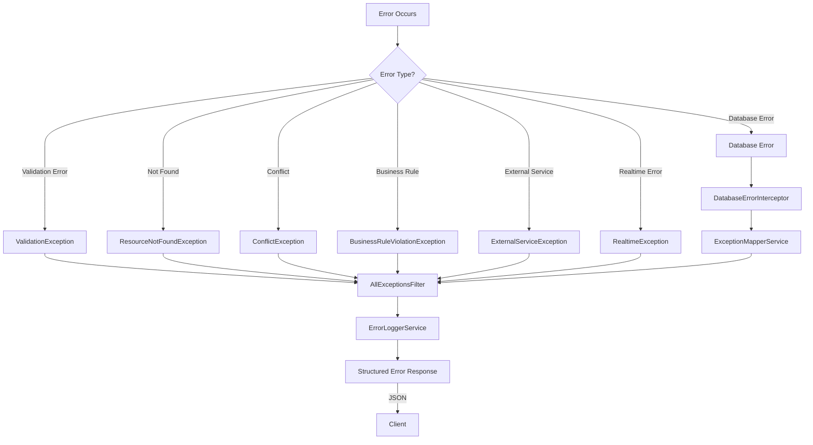
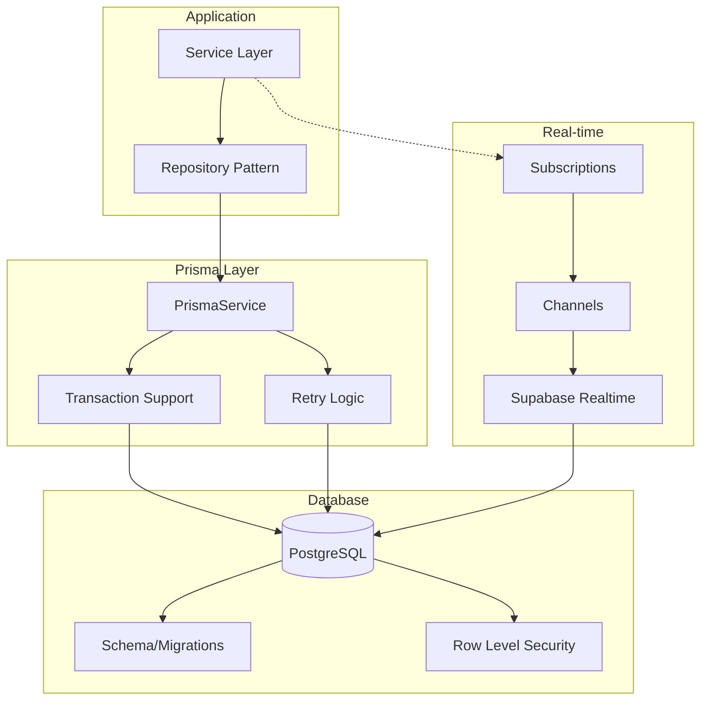
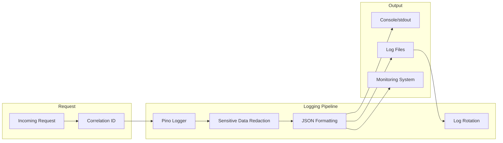
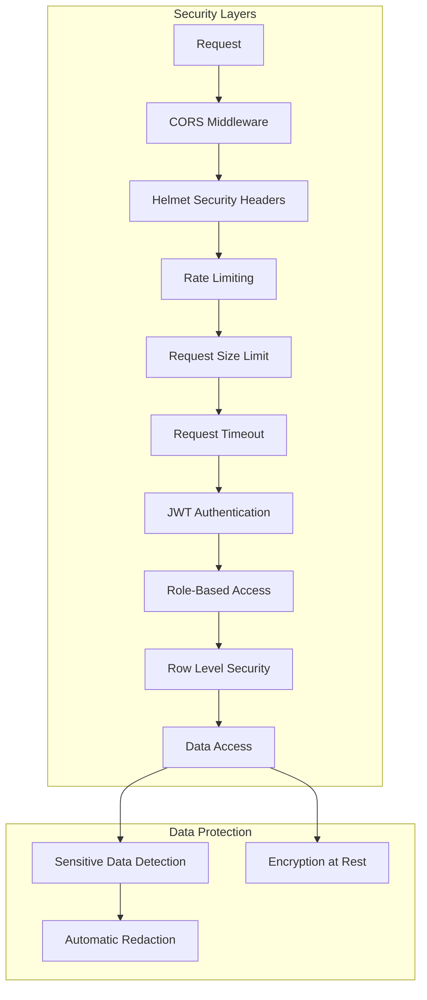
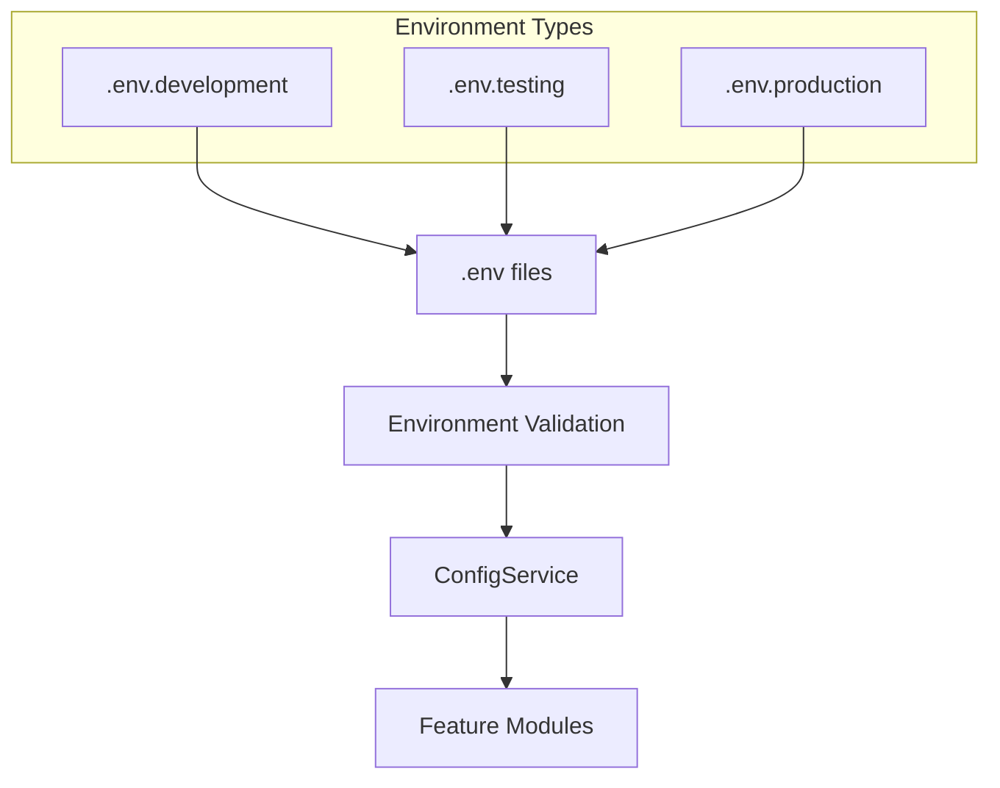
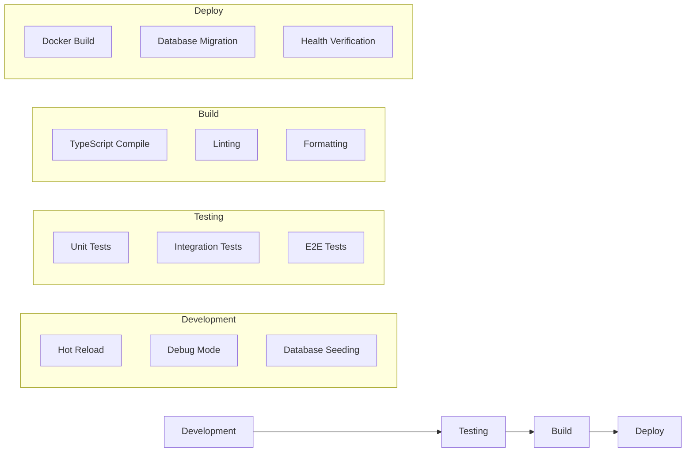

# NestJS Backend Server Architecture

## High-Level Architecture Overview

## Detailed Component Architecture

## Domain-Driven Design (DDD) Layer Architecture

## Module Dependencies

## Error Handling Flow

## Database Architecture

## Logging and Monitoring Architecture

## Security Architecture

## Key Components Explained

### 1. **Middleware Layer**

- **Correlation ID**: Tracks requests across the system
- **Request Size Limit**: Prevents large payload attacks
- **Request Timeout**: Prevents hung requests
- **Logger Middleware**: Logs all requests/responses

### 2. **Controller Layer (API)**

- RESTful endpoints
- Request handling
- Response formatting
- Route definitions

### 3. **Service Layer (Core)**

- Business logic implementation
- Domain rules enforcement
- Transaction orchestration
- External service integration

### 4. **Repository Layer**

- Data access abstraction
- Query building
- Transaction management
- Cache integration

### 5. **Infrastructure Services**

- **Prisma**: Type-safe ORM
- **Supabase**: Real-time subscriptions
- **Redis**: Caching layer
- **Health Checks**: System monitoring

### 6. **Cross-Cutting Concerns**

- **Logger**: Structured JSON logging with Pino
- **Exception Handling**: Centralized error processing
- **Validation**: DTO validation with class-validator
- **Authentication**: JWT-based auth
- **Authorization**: Role-based access control

## Configuration Management

## Development Workflow

## Performance Considerations

1. **Connection Pooling**: Prisma manages database connections
2. **Caching Strategy**: Redis for frequently accessed data
3. **Request Batching**: Supabase realtime for efficient updates
4. **Lazy Loading**: Modules loaded on demand
5. **Query Optimization**: Indexed database queries

## Scalability Features

1. **Horizontal Scaling**: Stateless architecture
2. **Load Balancing**: Ready for multiple instances
3. **Database Sharding**: Supported via Prisma
4. **Microservices Ready**: Modular design for extraction
5. **Event-Driven**: Real-time capabilities via Supabase

## Monitoring and Observability

1. **Health Endpoints**: `/health` for system status
2. **Structured Logging**: JSON logs for parsing
3. **Correlation IDs**: Request tracing
4. **Performance Metrics**: Ready for APM integration
5. **Error Tracking**: Detailed error context logging
